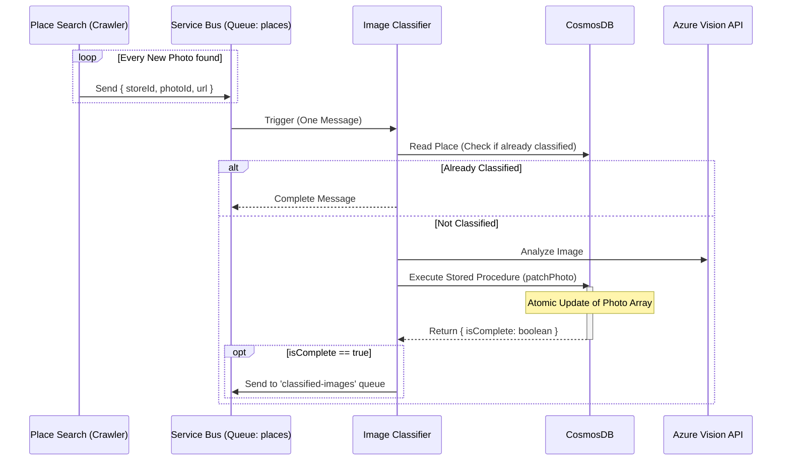

# Refactoring Plan: Decoupling & Robustness (v2)

## Status

- **Datum:** 11.01.2026
- **Ziel:** Entkopplung von `place-search` und `image-classifier`, Erhöhung der Race-Safety und Robustheit gegenüber API Rate Limits.

## 1. Design Entscheidungen

### A. Granularität der Nachrichten (Decoupling)

Anstatt komplette `Place`-Objekte oder Arrays von Fotos durch das System zu reichen, stellen wir auf eine **Single-Photo-Architektur** um.

- **Alt:** `NewPhotosMessage { id: string, photos: Photo[] }`
- **Neu:** `PhotoClassificationMessage { storeId: string, photoId: string, url: string }`
- **Vorteil:**
  - Granulare Steuerung der API-Last (1 Nachricht = 1 API Call).
  - Fehlertoleranz: Wenn ein Bild fehlschlägt, blockiert es nicht den ganzen Laden.
  - Bessere Skalierung über die Azure Service Bus Prefetch & Concurrency Einstellungen.

### B. Datenbank Race Safety (Atomic Updates)

Da Crawler und Classifier gleichzeitig auf dasselbe `Place`-Dokument schreiben können, müssen wir "Lost Updates" verhindern.

1.  **Image Classifier (Stored Procedure):**
    - Wir nutzen eine CosmosDB Stored Procedure (`patchPhoto`), um das Klassifizierungs-Ergebnis zu speichern.
    - Die SP liest das Dokument, findet das spezifische Foto im Array, aktualisiert es und schreibt zurück – alles in einer atomaren Transaktion.
    - **Logic:** "Update Photo X inside Place Y. If all photos are now categorized, return flag `isComplete: true`."

2.  **Place Search (Optimistic Concurrency Control):**
    - Der Crawler nutzt das `_etag` Feld.
    - Beim `replace` (Upsert) wird das gelesene ETag mitgesendet.
    - Bei einem `412 Precondition Failed` Fehler (Dokument wurde zwischendurch geändert, z.B. durch den Classifier) lädt der Crawler das Dokument neu, merged seine Änderungen erneut und versucht den Upsert nochmals (Retry-Loop).

### C. Flow Control & Downstream Trigger

Der `llm-analyzer` soll weiterhin nur **einmal pro Laden** getriggert werden, wenn alle Daten bereitstehen.

- Der `image-classifier` prüft nach jedem Foto-Update (via Return-Value der Stored Procedure), ob noch unklassifizierte Bilder im `Place` existieren.
- Nur wenn `uncategorized_count == 0`, wird eine Nachricht an die Queue `classified-images` gesendet.

### D. Robustheit & Rate Limiting

- **Azure Vision API:** Die Last wird über `host.json` im `image-classifier` kontrolliert.
  - `extensions.serviceBus.messageHandlerOptions.maxConcurrentCalls`: Setzen auf z.B. `2` oder `5`.
- **Idempotenz:** Bevor der `image-classifier` die teure Vision API aufruft, prüft er in der DB, ob das Foto (`photoId`) bereits eine Kategorie != `uncategorized` hat. Falls ja, wird die Nachricht sofort als "Completed" markiert.

## 2. Architektur Diagramm (Soll)

